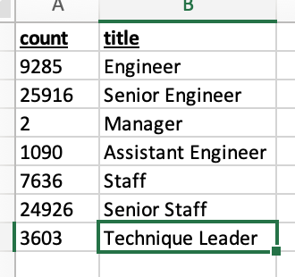

# Pewlett-Hackard-Analysis #

## 1. Overview of the analysis: Explain the purpose of this analysis ##
 - The purpose of this analysis is to map out what departments will have a mass exodus of employees dute to retirment in a bite size format so it is easeir to understand.

## 2.Results ##
- First thing that one notices is that the company will not have enough young employees to fill in for the ones leaving. 
- the amount of employees that are eligible for mentorship is just a fraction of the people leaving.
- Some departments will be hit alot harder than others.
- Company needs to start looking for new hires asap.

## 3.Summary ##
- the best way to show show the amount of people leaving from each department is in the following image. As you can see the "silver tsunami" will hit most of the departments hard. 

### Are there enough qualified, retirement-ready employees in the departments to mentor the next generation of Pewlett Hackard employees? ###
-The short answer is no. The list of people on the mentor list will not even fully replace the employees leaving some of the harder hit departments. 
